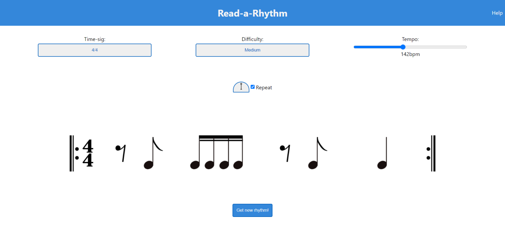

# Read-a-Rhythm 
### (A music app to practice reading rhythms)

Built with React, I have attempted to create a simple but effective practice tool to use by students and teachers
of music. It generates a random bar of note-values based on the time-signature and difficulty selection.
You can change the tempo, use the metronome (which also gives you a count-in and highlights the beats) and toggle repeat bars on or off.

It was a challenging but enjoyable project with many conditionals, loops and timing functions to implement the metronome and generate the random notes. 

## Potential Improvements/additional features

- Playback/demo for each rhythm
- Highlight each individual note(rather than each beat)
- Wider selection of time-signatures
- Larger bank of notes to generate music

## Screenshot

